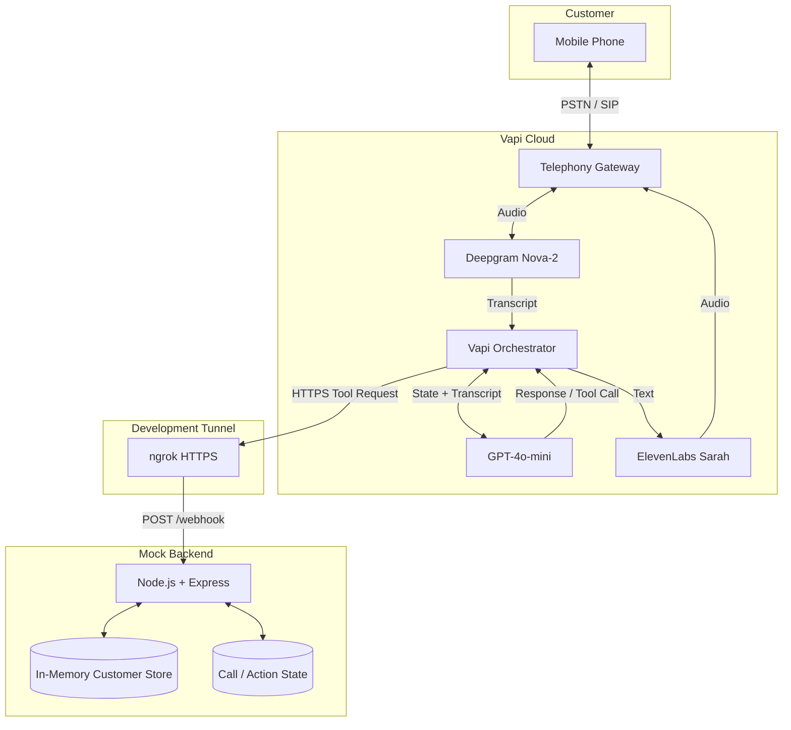

# Kapture Finance Voice AI Collections Agent --- Maya
> An automated Voice AI collections agent built with Vapi, Deepgram,
> OpenAI, ElevenLabs, and a Node.js/Express mock backend.

Maya is designed to handle outbound collections conversations while
enforcing a strict identity-verification gate before any account or
financial information is disclosed.

------------------------------------------------------------------------

## Table of Contents

-   [Overview](#overview)
-   [Features](#features)
-   [Architecture](#architecture)
-   [Conversation Flow](#conversation-flow)
-   [Technology Stack](#technology-stack)
-   [Project Structure](#project-structure)
-   [Prerequisites](#prerequisites)
-   [Environment Variables](#environment-variables)
-   [Backend Setup](#backend-setup)
-   [Vapi Configuration](#vapi-configuration)
-   [ngrok Setup](#ngrok-setup)
-   [Available Tools](#available-tools)
-   [API Endpoints](#api-endpoints)
-   [Authentication and Data Safety](#authentication-and-data-safety)
-   [Supported Conversation
    Scenarios](#supported-conversation-scenarios)
-   [PTP Flow](#ptp-flow)
-   [Testing](#testing)
-   [Observability](#observability)
-   [Latency](#latency)
-   [Security Invariants](#security-invariants)
-   [Production Evolution](#production-evolution)
-   [Documentation](#documentation)
-   [License](#license)

------------------------------------------------------------------------

## Overview

**Maya** is an automated outbound Voice AI Collections Agent for
**Kapture Finance**.

The system connects a customer phone call to a Vapi voice pipeline:

``` text
Customer Phone
      |
      v
Vapi / Telephony
      |
      v
Deepgram Nova-2
      |
      v
GPT-4o-mini
      |
      +----> Mock Backend Tools
      |
      v
ElevenLabs Sarah
      |
      v
Customer
```

The Node.js/Express backend provides the business actions required by
the conversation:

-   Customer verification
-   Promise-to-Pay recording
-   Payment-link sending
-   Call disposition
-   Human-agent escalation

The current backend is intentionally a **mock implementation** using
in-memory data so the complete voice flow can be demonstrated without
connecting to a real loan-management or payment system.

------------------------------------------------------------------------

## Features

## link
GitHUb :  Repo[https://github.com/thvvamshi/kapture-collections-voicebot]


### Voice Conversation

-   Outbound voice interaction through Vapi
-   Real-time speech-to-text using Deepgram Nova-2
-   LLM conversation orchestration using GPT-4o-mini
-   Natural text-to-speech using ElevenLabs Sarah
-   English and Hindi/Hinglish conversation support

### Authentication

-   Mandatory identity verification
-   Verification using the last four PAN digits or year of birth
-   Maximum verification attempts
-   No financial disclosure before successful authentication
-   Dynamic customer lookup
-   Verification values are masked in backend logs

### Collections

-   Overdue-account disclosure after authentication
-   Promise-to-Pay collection
-   Payment-link request handling
-   Already-paid handling
-   Financial-hardship escalation
-   Debt-dispute escalation
-   Human-agent requests
-   Do-not-call handling

### Safety

-   No third-party debt disclosure
-   No fabricated account information
-   No fabricated tool results
-   No unauthorized discounts or settlements
-   No legal threats
-   No credit-score promises
-   Strict tool-result validation

### Observability

-   Health endpoint
-   Call-history endpoint
-   Tool execution logging
-   Masked sensitive data
-   PTP/disposition/escalation counters

------------------------------------------------------------------------

# Architecture

## High-Level Architecture



## Component Responsibilities

  Component          Responsibility
  ------------------ -------------------------------------------------
  Vapi               Voice-call orchestration
  Deepgram Nova-2    Speech-to-text
  GPT-4o-mini        Intent understanding and conversation decisions
  ElevenLabs Sarah   Text-to-speech
  Node.js            Backend runtime
  Express            HTTP/webhook API
  ngrok              Public HTTPS tunnel during local development
  In-memory store    Demo customer and action state

------------------------------------------------------------------------

# Conversation Flow

The core flow is:

``` text
INIT
  |
  v
Customer Answers
  |
  v
AUTH_PENDING
  |
  v
Customer Provides Verification
  |
  v
verify_customer()
  |
  +---- verified=false ----> Retry
  |
  +---- verified=true ----> AUTHENTICATED
                                |
                                v
                           Account Disclosure
                                |
                                v
                           NEGOTIATION
                         /       |       \
                        /        |        \
                      PTP      Dispute   Hardship
                       |          |         |
                       v          v         v
                  PTP_COLLECTED ESCALATED ESCALATED
                       |          |         |
                       +----------+---------+
                                  |
                                  v
                             CALL_ENDED
```

## Authentication Gate

The most important system invariant is:

``` text
AUTH_PENDING
      |
      | verify_customer returns verified=true
      v
AUTHENTICATED
```

Maya must never disclose:

-   Loan information
-   Overdue information
-   Debt
-   Balance
-   EMI
-   Payment information
-   Overdue amount
-   Days overdue
-   Loan type
-   Account-specific information

until `verify_customer` returns:

``` json
{
  "verified": true
}
```

------------------------------------------------------------------------

# Technology Stack

  Layer                 Technology
  --------------------- ---------------------------------
  Voice Orchestration   Vapi
  Telephony             Vapi telephony / PSTN-SIP
  Speech-to-Text        Deepgram Nova-2
  LLM                   OpenAI GPT-4o-mini
  Text-to-Speech        ElevenLabs Sarah
  Backend               Node.js
  API Framework         Express
  Development Tunnel    ngrok
  Data Store            In-memory JavaScript structures
  Diagrams              Mermaid

------------------------------------------------------------------------

# Project Structure

Recommended repository structure:

``` text
kapture-collections-voicebot/
│
├── README.md
├── docs/
│   ├── HLD_Document.md
│   └── System_Architecture.png
│
├── vapi/
│   ├── system_prompt.txt
│   └── tool_definitions.json
│
├── mock-server/
│   ├── package.json
│   ├── server.js
│   └── .env.example
│
└── tests/
    └── test_cases.json
```

------------------------------------------------------------------------

# Prerequisites

Install the following:

-   Node.js
-   npm
-   ngrok
-   A Vapi account
-   A Deepgram configuration
-   An OpenAI configuration
-   An ElevenLabs configuration

Verify Node.js:

``` bash
node --version
npm --version
```

Verify ngrok:

``` bash
ngrok version
```

------------------------------------------------------------------------

# Environment Variables

Create:

``` text
mock-server/.env
```

Example:

``` env
PORT=3000
```

Provider credentials are configured in the appropriate Vapi/provider
configuration.

Do **not** commit API keys to Git.

Example `.gitignore`:

``` gitignore
node_modules/
.env
.env.*
!.env.example
```

------------------------------------------------------------------------

# Backend Setup

Move into the mock backend:

``` bash
cd mock-server
```

Install dependencies:

``` bash
npm install
```

Start the server:

``` bash
npm start
```

or, if the project uses a development script:

``` bash
npm run dev
```

The server should expose:

``` text
http://localhost:3000
```

------------------------------------------------------------------------

# ngrok Setup

Vapi needs a publicly reachable HTTPS endpoint to call the local
backend.

Start ngrok:

``` bash
ngrok http 3000
```

ngrok will provide an HTTPS URL similar to:

``` text
https://<generated-id>.ngrok-free.app
```

Configure the Vapi tool server URL using:

``` text
https://<generated-id>.ngrok-free.app/webhook
```

Do not hard-code the ngrok URL into source code because it can change
between sessions.

------------------------------------------------------------------------

# Vapi Configuration

The assistant should be configured with:

### Model

``` text
OpenAI
GPT-4o-mini
Temperature: 0.1
```

### STT

``` text
Deepgram
Nova-2
Language: en-IN
```

### TTS

``` text
ElevenLabs
Sarah
eleven_multilingual_v2
```

### Server URL

``` text
https://<ngrok-url>/webhook
```

The Vapi assistant must use the Maya system prompt containing the
authentication, privacy, tool-execution, and collections rules.

------------------------------------------------------------------------

# Available Tools

Maya uses five backend tools.

## 1. verify_customer {#1-verify_customer}

Authenticates the customer.

``` json
{
  "account_id": "ACC-88392",
  "verification_code": "1234"
}
```

The backend returns customer information only after successful
verification.

Example:

``` json
{
  "verified": true,
  "customer": {
    "name": "Rahul Sharma",
    "loan_type": "Personal Loan",
    "overdue_amount": 8499,
    "days_overdue": 12
  }
}
```

------------------------------------------------------------------------

## 2. log_promise_to_pay {#2-log_promise_to_pay}

Records a customer\'s payment commitment.

``` json
{
  "account_id": "ACC-88392",
  "ptp_date": "2026-08-14",
  "amount": 8499,
  "payment_method": "UPI"
}
```

------------------------------------------------------------------------

## 3. send_payment_link {#3-send_payment_link}

Sends the requested payment link.

``` json
{
  "account_id": "ACC-88392",
  "channel": "SMS"
}
```

Supported channels:

``` text
SMS
WHATSAPP
BOTH
```

------------------------------------------------------------------------

## 4. mark_disposition {#4-mark_disposition}

Records the final outcome.

Allowed statuses:

``` text
PTP_AGREED
ALREADY_PAID
DISPUTED
HARDSHIP_ESCALATED
WRONG_PERSON
DO_NOT_CALL
NO_RESPONSE
```

Example:

``` json
{
  "account_id": "ACC-88392",
  "status": "PTP_AGREED",
  "notes": "Customer committed to pay 8499 on 2026-08-14."
}
```

------------------------------------------------------------------------

## 5. escalate_to_agent {#5-escalate_to_agent}

Creates a human-agent escalation.

Supported reasons:

``` text
HARDSHIP_REQUEST
DISPUTE
COMPLAINT
CUSTOMER_REQUEST
```

Example:

``` json
{
  "account_id": "ACC-88392",
  "reason": "HARDSHIP_REQUEST",
  "priority": "MEDIUM",
  "notes": "Customer reports financial hardship."
}
```

------------------------------------------------------------------------

# API Endpoints

## POST `/webhook`

Main Vapi tool endpoint.

Example:

``` bash
curl -X POST http://localhost:3000/webhook \
  -H "Content-Type: application/json" \
  -d '{
    "tool": "verify_customer",
    "account_id": "ACC-88392",
    "verification_code": "1234"
  }'
```

The exact Vapi request wrapper can vary depending on the configured Vapi
API Request tool.

------------------------------------------------------------------------

## GET `/health`

Checks backend health.

``` bash
curl http://localhost:3000/health
```

Example response:

``` json
{
  "status": "healthy",
  "service": "kapture-collections-mock-server",
  "uptime": 21.26,
  "customers": 3,
  "active_verification_trackers": 0,
  "total_ptps": 0,
  "total_payments": 0,
  "total_dispositions": 0,
  "total_escalations": 0
}
```

------------------------------------------------------------------------

## GET `/calls`

Returns call/disposition history.

``` bash
curl http://localhost:3000/calls
```

Sensitive account information should be returned in masked form.

------------------------------------------------------------------------

# Authentication and Data Safety

Authentication is mandatory.

## Correct Flow

``` text
Customer confirms identity
          |
          v
Ask for verification
          |
          v
Customer says "1234"
          |
          v
verify_customer()
          |
          +---- false ----> Retry
          |
          +---- true -----> Disclose account information
```

## Important Tool-Execution Rule

When the customer provides a verification value, Maya must immediately
execute:

``` text
verify_customer
```

Maya must **not** say:

``` text
"Let me verify that."
"Calling verification."
"I'm checking your account."
"Please hold while I check."
```

Instead:

``` text
Customer: "1234"

[tool executes silently]

Maya: "Thank you for verifying your identity."
```

This avoids exposing internal implementation details and prevents
unnecessary conversational latency.

------------------------------------------------------------------------

# Supported Conversation Scenarios

## Happy Path

``` text
Greeting
   ↓
Customer confirms identity
   ↓
Verification
   ↓
verify_customer = true
   ↓
Account disclosure
   ↓
Customer agrees to pay
   ↓
PTP
   ↓
Payment link
   ↓
Disposition
   ↓
Closing
```

## Already Paid

``` text
Authentication
   ↓
Customer: "I already paid"
   ↓
Ask payment date/method
   ↓
mark_disposition(ALREADY_PAID)
   ↓
Closing
```

## Dispute

``` text
Authentication
   ↓
Customer disputes amount/debt
   ↓
escalate_to_agent(DISPUTE)
   ↓
mark_disposition(DISPUTED)
   ↓
Closing
```

## Financial Hardship

``` text
Authentication
   ↓
Customer reports hardship
   ↓
Capture hardship details
   ↓
escalate_to_agent(HARDSHIP_REQUEST)
   ↓
mark_disposition(HARDSHIP_ESCALATED)
   ↓
Closing
```

## Human Agent Request

``` text
Customer requests human
       ↓
escalate_to_agent(CUSTOMER_REQUEST)
       ↓
Closing / transfer according to workflow
```

## Do Not Call

``` text
Customer: "Don't call me again"
       ↓
mark_disposition(DO_NOT_CALL)
       ↓
End immediately
```

## Wrong Person

``` text
Customer: "Wrong number"
       ↓
No financial disclosure
       ↓
mark_disposition(WRONG_PERSON)
       ↓
End call
```

------------------------------------------------------------------------

# PTP Flow

A Promise-to-Pay requires:

1.  Payment date.
2.  Payment amount.
3.  Payment method when provided.

The required tool order is:

``` text
log_promise_to_pay
        ↓
send_payment_link   (only if requested)
        ↓
mark_disposition
```

For example:

``` text
Customer:
"I'll pay the full amount tomorrow. Send me the payment link."

        ↓

log_promise_to_pay
        ↓
send_payment_link
        ↓
mark_disposition(PTP_AGREED)
        ↓
Closing
```

Maya must not claim:

> \"Your payment commitment has been recorded.\"

until `log_promise_to_pay` actually succeeds.

Likewise, Maya must not claim:

> \"The payment link has been sent.\"

until `send_payment_link` actually succeeds.

------------------------------------------------------------------------

# Tool Failure Handling

If a tool fails:

``` text
Tool fails
   ↓
Retry once
   ↓
Success?
  / \
Yes  No
 |    |
 v    v
Continue
      |
      v
"I’m unable to complete this action at the moment.
Your request has been noted for follow-up."
```

The assistant must never fabricate a successful tool result.

------------------------------------------------------------------------

# Observability

The backend tracks:

-   Tool calls
-   Response times
-   Verification attempts
-   PTPs
-   Payment-link actions
-   Dispositions
-   Escalations
-   Call history

Sensitive verification values are masked.

Example backend log:

``` text
POST /webhook
Direct API tool: verify_customer
Tool result: {"verified":true,...}
Response: 200
```

------------------------------------------------------------------------

# Latency

## Target

The assignment target is:

``` text
< 1.2 seconds
```

for the end-to-end conversational response.

Target budget:

  Component               Target
  -------------------- ---------
  Telephony               \~50ms
  Deepgram STT           \~200ms
  Vapi orchestration      \~50ms
  GPT-4o-mini            \~400ms
  Tool/API               \~100ms
  ElevenLabs TTS         \~300ms
  Telephony output       \~100ms

The target is an engineering objective rather than a guaranteed latency
for every call.

------------------------------------------------------------------------

# Security Invariants

The following rules must always hold:

``` text
1. No verified=true → No financial disclosure.

2. No current account context → Never invent account_id.

3. Tool failure → Never claim success.

4. Third party → Never disclose customer debt.

5. DNC request → Stop collections flow immediately.

6. Verification code → Never expose in logs or speech.

7. PTP success → Only claim PTP after log_promise_to_pay succeeds.

8. Payment-link success → Only claim link sent after send_payment_link succeeds.

9. Final disposition → Use only an allowed disposition status.

10. Previous call data → Never reuse information from another call.
```

------------------------------------------------------------------------

# Testing

Recommended test cases:

  Test                               Expected Result
  ---------------------------------- -----------------------------------
  Customer confirms identity         Verification requested
  Customer asks amount before auth   No financial disclosure
  Correct verification               Authentication succeeds
  Incorrect verification             Retry
  Three failed attempts              Call ends
  Customer agrees to PTP             PTP recorded
  Customer asks for payment link     Link sent after PTP succeeds
  Already paid                       `ALREADY_PAID`
  Dispute                            Escalation + `DISPUTED`
  Hardship                           Escalation + `HARDSHIP_ESCALATED`
  DNC                                `DO_NOT_CALL`
  Wrong person                       `WRONG_PERSON`
  Human request                      `CUSTOMER_REQUEST` escalation
  Silence                            `NO_RESPONSE`
  Tool failure                       Retry without fabricating success
  Hindi/Hinglish                     State preserved
  Multiple customers                 Correct dynamic account data

------------------------------------------------------------------------

# Demo Flow

For a successful demo:

### 1. Start backend {#1-start-backend}

``` bash
cd mock-server
npm install
npm start
```

### 2. Start ngrok {#2-start-ngrok}

``` bash
ngrok http 3000
```

### 3. Configure Vapi {#3-configure-vapi}

Set the webhook URL:

``` text
https://<ngrok-url>/webhook
```

Configure:

``` text
STT  → Deepgram Nova-2
LLM  → GPT-4o-mini
TTS  → ElevenLabs Sarah
```

### 4. Start a call {#4-start-a-call}

Expected interaction:

``` text
Maya:
Hello, this is Maya calling from Kapture Finance.
Am I speaking with the customer?

Customer:
Yes.

Maya:
For security purposes, could you please confirm
the last 4 digits of your PAN card or your year of birth?

Customer:
1234

[verify_customer executes silently]

Maya:
Thank you for verifying your identity.

[Account information is disclosed from the tool result]

Customer:
I'll pay the full amount tomorrow. Send me the payment link.

[log_promise_to_pay]
[send_payment_link]
[mark_disposition]

Maya:
Your payment commitment has been recorded and the payment
link has been sent. Thank you for your time today.
```

------------------------------------------------------------------------

# Production Evolution

The demo backend can later be replaced with production services:

``` text
Current Demo
------------

In-Memory Customer Store
        ↓
Mock Payment Action
        ↓
Mock Escalation
        ↓
Mock Disposition


Production
----------

Loan Management / CRM
        ↓
Identity Verification Service
        ↓
Payment Gateway
        ↓
SMS / WhatsApp Provider
        ↓
Persistent Database
        ↓
Ticketing / Agent Platform
        ↓
Production Observability
```

Potential future enhancements:

1.  Real CRM/loan-management integration.
2.  Real payment gateway.
3.  Persistent call and disposition storage.
4.  Production DNC/consent management.
5.  Additional Indian languages.
6.  Sentiment analysis.
7.  Call-recording analytics.
8.  Agent-assist dashboard.
9.  Partial payment plans.
10. Proactive SMS/WhatsApp reminders.

------------------------------------------------------------------------

# Documentation

Detailed system design:

``` text
docs/HLD_Document.md
```

The HLD contains:

-   System architecture
-   Sequence diagrams
-   Pipeline and latency budget
-   Conversation state machine
-   Intents and entities
-   Tool/API specifications
-   Authentication and data safety
-   Compliance guardrails
-   Edge cases
-   Observability
-   Testing and validation
-   Production evolution

------------------------------------------------------------------------

# Important Notes

This repository is a demonstration implementation.

The backend uses mock/in-memory data and should **not** be treated as a
production financial system.

Do not use real customer PII, real PAN values, real account numbers, or
production payment credentials during testing.

The most important design principle is:

``` text
VERIFY FIRST
     ↓
DISCLOSE SECOND
     ↓
ACT
     ↓
LOG
     ↓
CLOSE
```

------------------------------------------------------------------------

# License

This project is provided for demonstration, assessment, and development
purposes.
