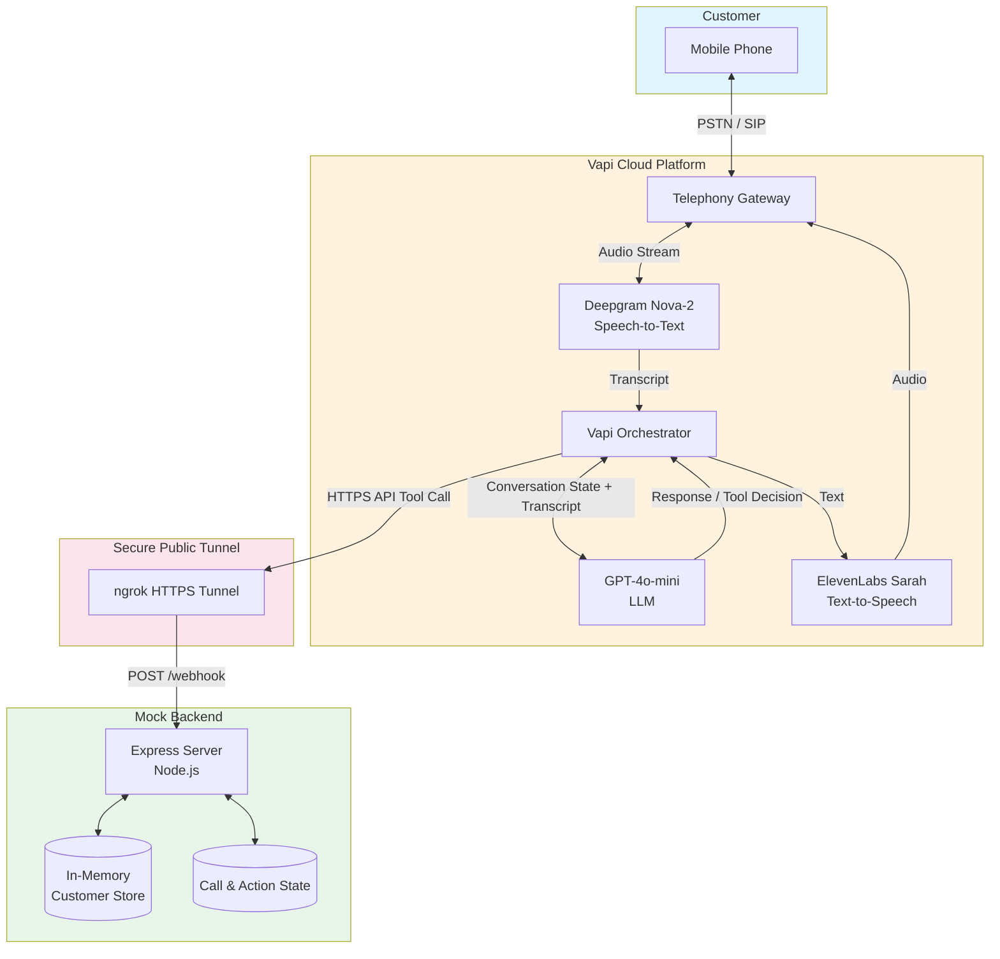
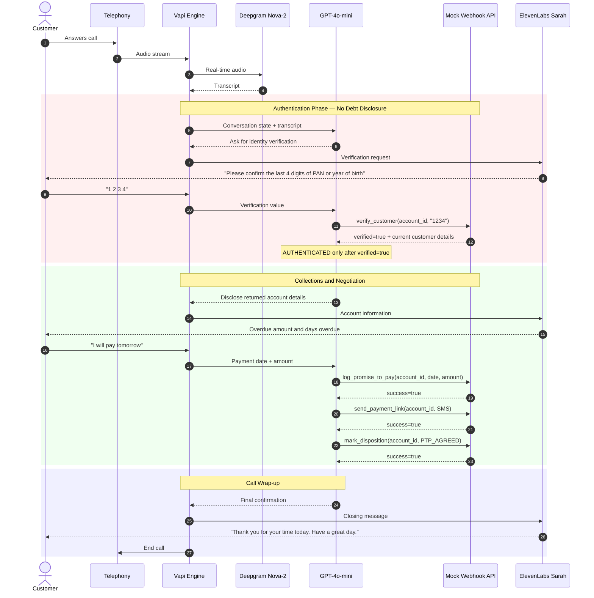

# High-Level Design Document

## Kapture Finance Voice AI Collections Agent --- \"Maya\" {#kapture-finance-voice-ai-collections-agent--maya}

**Version:** 1.0\
**Date:** August 12, 2026\
**Status:** Implementation HLD\
**Author:** Boda vamshi kumar

------------------------------------------------------------------------

## Table of Contents

1.  [Overview](#1-overview)
2.  [System Architecture](#2-system-architecture)
3.  [Pipeline and Latency Budget](#3-pipeline-and-latency-budget)
4.  [Conversation State Machine](#4-conversation-state-machine)
5.  [Intents and Entities](#5-intents-and-entities)
6.  [Tool and API Specifications](#6-tool-and-api-specifications)
7.  [Authentication and Data Safety](#7-authentication-and-data-safety)
8.  [Compliance and Guardrails](#8-compliance-and-guardrails)
9.  [Edge Cases Matrix](#9-edge-cases-matrix)
10. [Observability and Metrics](#10-observability-and-metrics)
11. [Testing and Validation](#11-testing-and-validation)
12. [Appendices](#12-appendices)

------------------------------------------------------------------------

# 1. Overview {#1-overview}

## 1.1 What We Built {#11-what-we-built}

Maya is an automated outbound Voice AI Collections Agent for Kapture
Finance.

The agent is designed to:

1.  Greet the customer without revealing financial information.
2.  Confirm that the intended customer is speaking.
3.  Authenticate the customer using a verification value.
4.  Disclose account information only after successful authentication.
5.  Understand the customer\'s intent.
6.  Collect a Promise-to-Pay (PTP) when appropriate.
7.  Send a mock payment link when requested.
8.  Handle already-paid, hardship, dispute, wrong-person, DNC, silence,
    voicemail, hostile-customer, and human-agent-request scenarios.
9.  Record the final call disposition.
10. End the call politely.

The assignment requires strict authentication before debt disclosure,
actionable resolution through PTP/payment-link flows or escalation, and
an engineer-ready HLD covering architecture, state management, tools,
security, compliance, edge cases, and observability.

## 1.2 Scope {#12-scope}

This implementation is a demonstration system.

The backend is a Node.js + Express mock API rather than a production
loan-management system or payment gateway. Customer records and
call/action state are held in memory for the demo.

The production architecture can replace the mock customer store and
action handlers with real CRM/loan-servicing, payment, notification, and
escalation systems without changing the core voice workflow.

## 1.3 Design Goals {#13-design-goals}

  Goal              Target / Requirement
  ----------------- -------------------------------------------------------------------------
  Authentication    Mandatory before financial disclosure
  Debt disclosure   Only after `verify_customer` returns `verified=true`
  PTP               Capture date and amount
  Payment link      Send through SMS/WhatsApp mock tool when requested
  Escalation        Human routing for disputes, hardship, complaints, and explicit requests
  DNC               Immediate opt-out handling
  Calling window    08:00--19:00 local time
  Latency target    `< 1.2s` end-to-end conversational target
  PII logging       Mask sensitive values
  Demo backend      Node.js + Express
  Public webhook    HTTPS through ngrok during development

------------------------------------------------------------------------

# 2. System Architecture {#2-system-architecture}

## 2.1 High-Level Architecture {#21-high-level-architecture}

The system consists of five logical layers:

1.  **Telephony** --- customer voice connection.
2.  **Vapi orchestration** --- call control, conversation orchestration,
    tool execution, and provider integration.
3.  **Speech/AI providers** --- Deepgram STT, GPT-4o-mini, and
    ElevenLabs Sarah.
4.  **Mock backend** --- Node.js + Express webhook API.
5.  **State/data layer** --- in-memory customer data, verification
    attempts, PTP/payment/disposition/escalation state.

### Architecture Diagram



## 2.2 Component Breakdown {#22-component-breakdown}

### Telephony / Vapi {#telephony--vapi}

Vapi provides the voice-call orchestration layer and connects the
assistant to the customer call.

The implementation does not directly manage SIP/PSTN infrastructure.
Vapi handles the telephony connection and audio transport.

### Deepgram Nova-2

Deepgram Nova-2 is used for real-time speech-to-text.

Current configuration:

-   Provider: Deepgram
-   Model: `nova-2`
-   Language: `en-IN`
-   Confidence threshold: `0.4`
-   Automatic fallback enabled

### GPT-4o-mini

GPT-4o-mini is the conversation and intent-orchestration model.

Responsibilities include:

-   Maintaining conversation context.
-   Following the authentication gate.
-   Identifying customer intent.
-   Extracting PTP date and amount.
-   Deciding when tools should be executed.
-   Producing the next conversational response.

The current Vapi configuration uses low temperature (`0.1`) to make the
workflow more deterministic.

### ElevenLabs Sarah

The voice layer uses:

-   Provider: ElevenLabs
-   Voice: Sarah
-   Model: `eleven_multilingual_v2`

The voice is configured for a professional female conversational style
and supports the required English/Hinglish demonstration.

### Mock Backend

The backend is an Express application running on Node.js.

It exposes one primary Vapi webhook:

``` text
POST /webhook
```

The webhook supports direct API-request tool calls and Vapi tool-call
payloads.

Implemented tools:

-   `verify_customer`
-   `log_promise_to_pay`
-   `send_payment_link`
-   `mark_disposition`
-   `escalate_to_agent`

### ngrok

During local development:

``` text
Vapi → HTTPS ngrok URL → localhost:3000
```

This makes the local Express server reachable from Vapi.

The exact ngrok URL is intentionally not hard-coded in this document
because it can change between sessions.

## 2.3 Sequence Diagram {#23-sequence-diagram}



## 2.4 Typical Data Flow {#24-typical-data-flow}

``` text
Customer
   |
   v
Telephony
   |
   v
Vapi
   |
   +--> Deepgram STT
   |
   +--> GPT-4o-mini
           |
           +--> verify_customer
           |       |
           |       v
           |    ngrok
           |       |
           |       v
           |    Express
           |       |
           |       v
           |    Customer Store
           |
           +--> log_promise_to_pay
           |
           +--> send_payment_link
           |
           +--> mark_disposition
           |
           +--> escalate_to_agent
   |
   v
ElevenLabs
   |
   v
Customer
```

------------------------------------------------------------------------

# 3. Pipeline and Latency Budget {#3-pipeline-and-latency-budget}

## 3.1 Target Pipeline {#31-target-pipeline}

The assignment defines the target pipeline as:

``` text
Telephony
   ↓
STT — Deepgram Nova-2
   ↓
Orchestrator / LLM — GPT-4o or GPT-4o-mini
   ↓
TTS — ElevenLabs / Cartesia
   ↓
Telephony Output
```

The assignment\'s target is less than 1.2 seconds for the end-to-end
conversational round trip, with approximate budgets of 200ms STT, 400ms
LLM first byte, 300ms TTS, and 200ms network overhead.

## 3.2 Target Latency Budget {#32-target-latency-budget}

  Component                      Target   Maximum Budget Responsibility
  ------------------------ ------------ ---------------- ---------------------------
  Telephony ingress                50ms            100ms Audio reaches Vapi
  Deepgram STT                    200ms            300ms Speech → text
  Vapi orchestration               50ms            100ms Routing/orchestration
  GPT-4o-mini first byte          400ms            600ms Reasoning + response
  Tool/API round trip             100ms            200ms Mock backend action
  ElevenLabs TTS                  300ms            400ms Text → speech
  Telephony egress                100ms            200ms Audio reaches customer
  **Target**                 **\~1.2s**       **\~2.0s** Conversational round trip

The target is an engineering budget, not a claim that every current
exchange achieves `<1.2s`.

## 3.3 Current Configuration Observation {#33-current-configuration-observation}

The current Vapi dashboard configuration used during development showed
approximately:

  Provider                           Configured Component        Dashboard Estimate
  ---------------------------------- ------------------------- --------------------
  Deepgram                           Nova-2 STT                             \~270ms
  OpenAI                             GPT-4o-mini                            \~550ms
  ElevenLabs                         Sarah / multilingual v2                \~820ms
  **Configured provider subtotal**                                      **\~1.64s**

Therefore:

-   **Assignment target:** `<1.2s`
-   **Current configured estimate:** approximately `1.64s`
-   **Mock API:** observed in local tests at only a few milliseconds for
    simple tool handlers.

The primary optimization opportunity in the current configuration is TTS
latency, followed by model latency.

## 3.4 Latency Mitigation {#34-latency-mitigation}

Potential optimizations include:

1.  Use lower-latency TTS where voice quality remains acceptable.
2.  Keep tool payloads small.
3.  Avoid unnecessary backend calls.
4.  Keep the prompt structured and deterministic.
5.  Use streaming responses where supported.
6.  Keep the mock API geographically close to the production Vapi region
    in a production deployment.
7.  Avoid long conversational filler before or after tools.

The implementation deliberately avoids saying \"please hold\" or
narrating tool execution because unnecessary speech increases perceived
latency and caused call-quality problems during testing.

------------------------------------------------------------------------

# 4. Conversation State Machine {#4-conversation-state-machine}

## 4.1 States {#41-states}

The implementation follows the assignment\'s state model:

``` text
INIT
  |
  v
AUTH_PENDING
  |
  | verify_customer -> verified=true
  v
AUTHENTICATED
  |
  v
NEGOTIATION
  |
  +----------------------+
  |                      |
  v                      v
PTP_COLLECTED         ESCALATED
  |                      |
  +----------+-----------+
             |
             v
        CALL_ENDED
```

## 4.2 State Definitions {#42-state-definitions}

  State             Description                                    Financial Disclosure
  ----------------- ---------------------------------------------- ------------------------------------
  `INIT`            Call starts and Maya introduces herself        Not allowed
  `AUTH_PENDING`    Customer identity is being verified            Not allowed
  `AUTHENTICATED`   `verify_customer` returned `verified=true`     Allowed
  `NEGOTIATION`     Customer intent is handled                     Allowed
  `PTP_COLLECTED`   PTP/payment actions completed                  Allowed
  `ESCALATED`       Human assistance required                      Only previously authenticated data
  `CALL_ENDED`      Final disposition recorded / call terminated   No new disclosure

## 4.3 Transition Rules {#43-transition-rules}

  From              To                Condition
  ----------------- ----------------- ----------------------------------------------------------------------------------
  `INIT`            `AUTH_PENDING`    Customer confirms they are the intended customer
  `INIT`            `CALL_ENDED`      Wrong person/customer unavailable
  `AUTH_PENDING`    `AUTHENTICATED`   `verify_customer` returns `verified=true`
  `AUTH_PENDING`    `AUTH_PENDING`    Verification fails and attempts remain
  `AUTH_PENDING`    `CALL_ENDED`      Maximum verification attempts reached
  `AUTH_PENDING`    `CALL_ENDED`      Immediate DNC / wrong-person termination
  `AUTHENTICATED`   `NEGOTIATION`     Account information has been disclosed
  `NEGOTIATION`     `PTP_COLLECTED`   PTP successfully recorded and required payment-link/disposition actions complete
  `NEGOTIATION`     `ESCALATED`       Hardship, dispute, complaint, or human request
  `NEGOTIATION`     `CALL_ENDED`      Already-paid, DNC, or other completed resolution
  `PTP_COLLECTED`   `CALL_ENDED`      Final disposition is logged
  `ESCALATED`       `CALL_ENDED`      Escalation and disposition are logged

## 4.4 Authentication Lock {#44-authentication-lock}

The critical invariant is:

``` text
AUTH_PENDING
      |
      | ONLY verify_customer verified=true
      v
AUTHENTICATED
```

A customer saying \"yes, that\'s me\" is not authentication.

A successful tool result is required.

Before successful authentication Maya must not disclose or confirm:

-   loan
-   overdue
-   EMI
-   debt
-   balance
-   payment information
-   overdue amount
-   days overdue
-   loan type
-   account-specific information
-   the reason for the collections call

The current mock backend also returns customer financial details only on
successful verification.

This creates two layers of protection:

1.  Conversation-level authentication gating.
2.  Backend-level data-return gating.

------------------------------------------------------------------------

# 5. Intents and Entities {#5-intents-and-entities}

## 5.1 Supported Intents {#51-supported-intents}

  Intent                   Description                                      Example
  ------------------------ ------------------------------------------------ -------------------------------
  `Confirm_Identity`       Customer confirms they are the intended person   \"Yes, that\'s me.\"
  `Provide_Verification`   Customer provides authentication information     \"1234\"
  `Promise_To_Pay`         Customer agrees to make payment                  \"I\'ll pay Friday.\"
  `Already_Paid`           Customer claims payment was already made         \"I paid yesterday via UPI.\"
  `Hardship_Claim`         Customer cannot pay due to hardship              \"I lost my job.\"
  `Dispute_Debt`           Customer disputes debt or amount                 \"This amount is wrong.\"
  `Request_DNC`            Customer requests no further calls               \"Don\'t call me again.\"
  `Wrong_Person`           Call reached an unintended person                \"Wrong number.\"
  `Customer_Request`       Customer explicitly requests human assistance    \"Let me speak to an agent.\"
  `Hostile`                Customer becomes abusive or threatening          Profanity / continued abuse
  `Callback_Request`       Customer asks for another time                   \"Call me tomorrow.\"

## 5.2 Entities {#52-entities}

  Entity                       Type       Example                    Use
  ---------------------------- ---------- -------------------------- ---------------------------------
  `Account_ID`                 String     `ACC-88392`                Identifies current call account
  `Verification_Code`          String     `1234`                     Authentication
  `PTP_Date`                   ISO date   `2026-08-14`               Payment commitment
  `PTP_Amount`                 Number     `8499`                     Payment commitment
  `Payment_Method`             String     `UPI`                      Optional PTP metadata
  `Hardship_Reason`            String     `Lost my job`              Escalation notes
  `Dispute_Reason`             String     `Amount is incorrect`      Dispute notes
  `Customer_Payment_Details`   String     `Paid yesterday via UPI`   Already-paid disposition

## 5.3 Date and Amount Rules {#53-date-and-amount-rules}

Relative dates must be normalized before calling the PTP tool.

Examples:

``` text
"tomorrow"
"this Friday"
"next Monday"
```

must become:

``` text
YYYY-MM-DD
```

If the customer says:

> \"I\'ll pay the full amount.\"

the amount must come from the successfully authenticated
`overdue_amount`.

If the customer states a specific amount, the exact customer-provided
amount is used.

The agent must not invent discounts, settlements, waivers, or fee
reversals.

------------------------------------------------------------------------

# 6. Tool and API Specifications {#6-tool-and-api-specifications}

## 6.1 Common Configuration {#61-common-configuration}

The Vapi API Request tools use:

``` text
Method: POST
Content-Type: application/json
Timeout: 20 seconds
Endpoint: HTTPS /webhook
```

During development:

``` text
Vapi
  ↓
ngrok HTTPS
  ↓
localhost:3000/webhook
```

## 6.2 verify_customer {#62-verify_customer}

### Purpose

Authenticate the current customer before any financial disclosure.

### Request

``` json
{
  "account_id": "ACC-88392",
  "verification_code": "1234"
}
```

### Success Response

``` json
{
  "verified": true,
  "message": "Identity verified successfully.",
  "customer": {
    "name": "Rahul Sharma",
    "loan_type": "Personal Loan",
    "overdue_amount": 8499,
    "days_overdue": 12
  },
  "attempts_remaining": 3
}
```

The values above are illustrative example data. Runtime customer data is
selected dynamically by the current account ID.

### Failure Response

``` json
{
  "verified": false,
  "message": "Verification failed. Please try again.",
  "attempts_made": 1,
  "attempts_remaining": 2,
  "locked": false
}
```

### Rules

-   Maximum three verification attempts.
-   Successful verification resets the attempt counter.
-   Customer details are returned only on success.
-   Verification codes are masked in logs.
-   The agent never reveals the correct verification value.

## 6.3 log_promise_to_pay {#63-log_promise_to_pay}

### Purpose

Record a customer commitment to make a payment.

### Request

``` json
{
  "account_id": "ACC-88392",
  "ptp_date": "2026-08-14",
  "amount": 8499,
  "payment_method": "UPI"
}
```

### Response

``` json
{
  "success": true,
  "ptp_id": "PTP-example",
  "account_id": "ACC-88392",
  "ptp_date": "2026-08-14",
  "amount": 8499,
  "payment_method": "UPI",
  "reference_number": "KAPT-PTP-example",
  "logged_at": "2026-08-12T06:09:03.470Z"
}
```

### Rules

The tool is called only after the customer explicitly commits to:

-   payment date
-   payment amount

## 6.4 send_payment_link {#64-send_payment_link}

### Purpose

Send a mock payment link to the customer\'s registered channel.

### Request

``` json
{
  "account_id": "ACC-88392",
  "channel": "SMS"
}
```

### Response

``` json
{
  "success": true,
  "transaction_id": "TXN-example",
  "account_id": "ACC-88392",
  "channel": "SMS",
  "message": "Payment link sent successfully via SMS.",
  "link_validity_hours": 24,
  "estimated_delivery_seconds": 5,
  "sent_at": "2026-08-12T06:13:01.041Z"
}
```

### Supported Channels

``` text
SMS
WHATSAPP
BOTH
```

The current happy-path flow uses SMS when the customer requests a
payment link.

## 6.5 mark_disposition {#65-mark_disposition}

### Purpose

Record the final outcome of the call.

### Request

``` json
{
  "account_id": "ACC-88392",
  "status": "PTP_AGREED",
  "notes": "Customer committed to pay 8499 on 2026-08-14."
}
```

### Allowed Statuses

``` text
PTP_AGREED
ALREADY_PAID
DISPUTED
HARDSHIP_ESCALATED
WRONG_PERSON
DO_NOT_CALL
NO_RESPONSE
```

### Rules

The assistant must not claim that the final disposition was recorded
unless the tool returns a successful result.

## 6.6 escalate_to_agent {#66-escalate_to_agent}

### Purpose

Create a human-agent escalation for cases that Maya should not resolve
automatically.

### Request

``` json
{
  "account_id": "ACC-88392",
  "reason": "HARDSHIP_REQUEST",
  "priority": "MEDIUM",
  "notes": "Customer reports financial hardship and requests assistance."
}
```

### Allowed Reasons

``` text
HARDSHIP_REQUEST
DISPUTE
COMPLAINT
CUSTOMER_REQUEST
```

### Allowed Priorities

``` text
LOW
MEDIUM
HIGH
URGENT
```

### Example Response

``` json
{
  "success": true,
  "ticket_id": "ESC-example",
  "account_id": "ACC-88392",
  "reason": "HARDSHIP_REQUEST",
  "assigned_team": "Financial Counseling Team",
  "priority": "MEDIUM",
  "estimated_callback_minutes": 30,
  "created_at": "2026-08-12T06:20:00.000Z"
}
```

------------------------------------------------------------------------

# 7. Authentication and Data Safety {#7-authentication-and-data-safety}

## 7.1 Authentication Flow {#71-authentication-flow}

### Step 1 --- Greeting {#step-1--greeting}

Maya says:

> \"Hello, this is Maya calling from Kapture Finance. Am I speaking with
> the customer?\"

The current implementation intentionally avoids hard-coding a customer
name in the first message.

### Step 2 --- Verification Request {#step-2--verification-request}

After the customer confirms:

> \"For security purposes, could you please confirm the last 4 digits of
> your PAN card or your year of birth?\"

No debt information is disclosed.

### Step 3 --- Verification Tool {#step-3--verification-tool}

When the customer provides the verification value:

``` text
verify_customer(
    account_id=current_account_id,
    verification_code=customer_input
)
```

The assistant does not narrate tool execution.

### Step 4 --- Gate Check {#step-4--gate-check}

If:

``` text
verified=true
```

the conversation enters the authenticated state.

If:

``` text
verified=false
```

the assistant requests another verification value while attempts remain.

After the maximum attempts are exhausted, the call ends without
financial disclosure.

## 7.2 Third-Party Protection {#72-third-party-protection}

If another person answers:

-   Do not mention the customer\'s loan.
-   Do not mention overdue status.
-   Do not mention the amount.
-   Do not disclose the reason for the call.
-   Ask whether the intended customer is available.
-   If unavailable, record the appropriate disposition and end the call.

## 7.3 Dynamic Customer Data {#73-dynamic-customer-data}

The runtime implementation does not rely on a hard-coded Rahul Sharma
account.

Customer records are stored dynamically in the mock backend.

Example records include:

``` text
ACC-88392
ACC-10001
...
```

The `account_id` supplied to Vapi tools must come from the current
call/workflow context.

The assistant must never invent an account ID or reuse account
information from another call.

## 7.4 Log Masking {#74-log-masking}

Sensitive values are masked before backend logs are written.

Examples:

``` text
Verification code:
****

Account ID:
masked form
```

The current backend explicitly masks `verification_code` and masks
numeric portions of `account_id`.

The principle is:

> Logs should provide enough information for debugging without
> unnecessarily exposing authentication secrets or full account
> identifiers.

------------------------------------------------------------------------

# 8. Compliance and Guardrails {#8-compliance-and-guardrails}

## 8.1 Collections Guardrails {#81-collections-guardrails}

The implementation follows the assignment\'s stated fair-collections
requirements:

-   Calling window: 08:00--19:00 local time.
-   No third-party debt disclosure without authentication.
-   Immediate DNC/opt-out handling.
-   No threats.
-   No harassment.
-   Respectful language.
-   Accurate representation of tool results.
-   No fabricated account information.

## 8.2 Hallucination Prevention {#82-hallucination-prevention}

Maya is instructed to:

1.  Use only data returned by successful tools.
2.  Never invent customer information.
3.  Never invent payment amounts.
4.  Never invent dates.
5.  Never invent payment status.
6.  Never promise unauthorized discounts or waivers.
7.  Never promise credit-score outcomes.
8.  Never claim a tool succeeded without a successful result.
9.  Never expose internal API information.
10. Never expose verification codes.

## 8.3 Unauthorized Financial Promises {#83-unauthorized-financial-promises}

Maya must not independently offer:

-   discounts
-   waivers
-   settlements
-   fee reversals
-   credit-score improvements
-   legal-outcome guarantees

The assistant may capture a customer\'s requested amount and route
unsupported requests to the appropriate human flow.

## 8.4 Company and Purpose Disclosure {#84-company-and-purpose-disclosure}

The agent identifies itself as Maya from Kapture Finance.

Before authentication, it does not reveal the financial reason for the
call.

This protects against accidental third-party debt disclosure.

## 8.5 DNC {#85-dnc}

If the customer says:

> \"Don\'t call me again.\"

or similar:

1.  Stop the collections conversation.
2.  Call `mark_disposition` with `DO_NOT_CALL`.
3.  Confirm the request was recorded after successful tool execution.
4.  End the call.

------------------------------------------------------------------------

# 9. Edge Cases Matrix {#9-edge-cases-matrix}

  Scenario                Trigger                   Expected Behavior                                      Tool
  ----------------------- ------------------------- ------------------------------------------------------ --------------------------------------------------------------------------------
  Wrong person            \"Wrong number\"          No disclosure; ask if intended customer is available   `mark_disposition(WRONG_PERSON)`
  Third party             \"I\'m his wife\"         No financial disclosure                                `mark_disposition(WRONG_PERSON)` if call ends
  Failed authentication   Wrong code                Ask for another verification value                     `verify_customer`
  Maximum auth failures   Three failed attempts     End without disclosure                                 `mark_disposition(NO_RESPONSE)`
  Already paid            \"I paid yesterday\"      Ask payment details and record outcome                 `mark_disposition(ALREADY_PAID)`
  Dispute                 \"The amount is wrong\"   Do not argue; escalate                                 `escalate_to_agent(DISPUTE)` + `mark_disposition(DISPUTED)`
  Hardship                \"I cannot pay\"          Capture reason and escalate                            `escalate_to_agent(HARDSHIP_REQUEST)` + `mark_disposition(HARDSHIP_ESCALATED)`
  DNC                     \"Stop calling me\"       Immediate opt-out                                      `mark_disposition(DO_NOT_CALL)`
  Human request           \"I want an agent\"       Escalate                                               `escalate_to_agent(CUSTOMER_REQUEST)`
  Hostile customer        Continued abuse           One respectful warning, then end                       `mark_disposition(NO_RESPONSE)`
  Silence                 No response               Two re-prompts, then end                               `mark_disposition(NO_RESPONSE)`
  Voicemail               Answering machine         No debt disclosure                                     End appropriately
  Language switch         English ↔ Hindi           Maintain state and continue                            No special API required
  Tool failure            API returns error         Do not claim success; retry/fallback                   Relevant tool
  Call disconnect         Unexpected hangup         Preserve available state/logging where supported       Call-event handling

## 9.1 Silence Handling {#91-silence-handling}

Maya uses two re-prompts:

1.  \"Hello, are you still there?\"
2.  \"Can you hear me?\"

If there is still no response, the call is ended and `NO_RESPONSE` is
recorded.

## 9.2 Hostile Customer {#92-hostile-customer}

Maya gives one calm warning:

> \"I understand you\'re upset. I\'m here to help, but I need us to keep
> the conversation respectful.\"

If abusive behavior continues, the call is terminated without continuing
the collections negotiation.

## 9.3 Language Switching {#93-language-switching}

The agent supports English and Hindi/Hinglish conversational switching.

The important requirement is that language switching must not reset the
state.

For example:

``` text
AUTH_PENDING
    ↓
Customer speaks Hindi
    ↓
AUTH_PENDING
    ↓
verify_customer
    ↓
AUTHENTICATED
```

Previously collected entities must remain available.

------------------------------------------------------------------------

# 10. Observability and Metrics {#10-observability-and-metrics}

## 10.1 Backend Observability {#101-backend-observability}

The mock server logs:

-   timestamp
-   HTTP method
-   request path
-   masked request body
-   detected tool
-   tool result
-   HTTP response status
-   response duration

Example:

``` text
============================================================
[2026-08-12T06:09:03.468Z] POST /webhook
Request body: {"account_id":"ACC-88392","ptp_date":"2026-08-14","amount":8499,"payment_method":"UPI"}
Direct API tool: log_promise_to_pay
Tool result: {"success":true,...}
Response: 200 | 5ms
```

Sensitive verification values are masked in logs.

## 10.2 Health Endpoint {#102-health-endpoint}

The backend exposes:

``` text
GET /health
```

The response reports operational state and counters such as:

``` json
{
  "status": "healthy",
  "service": "kapture-collections-mock-server",
  "uptime": 21.26,
  "customers": 3,
  "active_verification_trackers": 0,
  "total_ptps": 0,
  "total_payments": 0,
  "total_dispositions": 0,
  "total_escalations": 0
}
```

The exact values change during runtime.

## 10.3 Call History {#103-call-history}

The backend exposes:

``` text
GET /calls
```

This provides disposition history with masked account identifiers.

## 10.4 Metric Definitions {#104-metric-definitions}

### Containment Rate

Percentage of calls resolved without human escalation.

``` text
Containment Rate =
Calls resolved without escalation
---------------------------------- × 100
Total completed calls
```

### PTP Rate

Percentage of eligible calls ending in a valid PTP.

``` text
PTP Rate =
PTP_AGREED calls
---------------- × 100
Eligible completed calls
```

### First Call Resolution

For this assignment, FCR follows the reference definition:

> percentage of valid dispositions logged.

``` text
FCR =
Calls with valid final disposition
----------------------------------- × 100
Completed calls
```

## 10.5 Target Metrics {#105-target-metrics}

  Metric                        Target
  --------------------------- --------
  Containment Rate               \>75%
  PTP Rate                       \>65%
  First Call Resolution          \>70%
  Authentication Success         \>85%
  End-to-end latency target     \<1.2s

These are targets, not claims of measured production performance.

------------------------------------------------------------------------

# 11. Testing and Validation {#11-testing-and-validation}

## 11.1 Test Matrix {#111-test-matrix}

  Test ID   Scenario                                           Expected Result
  --------- -------------------------------------------------- -------------------------------------------
  TC-001    Basic greeting                                     No financial information disclosed
  TC-002    Customer asks \"How much do I owe?\" before auth   Authentication response only
  TC-003    Correct verification                               `verify_customer` returns `verified=true`
  TC-004    Failed verification                                No debt disclosure
  TC-005    Three failed verifications                         Call terminates
  TC-006    Happy-path PTP                                     PTP logged
  TC-007    Payment link request                               Payment link sent after PTP succeeds
  TC-008    Final PTP disposition                              `PTP_AGREED` recorded
  TC-009    Already paid                                       `ALREADY_PAID` recorded
  TC-010    Dispute                                            Human escalation + `DISPUTED`
  TC-011    Hardship                                           Human escalation + `HARDSHIP_ESCALATED`
  TC-012    DNC                                                Immediate `DO_NOT_CALL`
  TC-013    Wrong person                                       No disclosure + `WRONG_PERSON`
  TC-014    Human-agent request                                `CUSTOMER_REQUEST` escalation
  TC-015    Silence                                            Two prompts + `NO_RESPONSE`
  TC-016    Hostile customer                                   Warning + controlled termination
  TC-017    Hindi/Hinglish                                     State preserved
  TC-018    Tool failure                                       No fabricated success
  TC-019    Dynamic customer 1                                 Correct account data returned
  TC-020    Dynamic customer 2                                 Different account data returned

## 11.2 Happy Path Validation {#112-happy-path-validation}

Expected sequence:

``` text
Greeting
   ↓
Customer confirms identity
   ↓
Verification request
   ↓
Customer provides verification value
   ↓
verify_customer
   ↓
verified=true
   ↓
Disclose returned overdue information
   ↓
Customer commits to payment
   ↓
log_promise_to_pay
   ↓
send_payment_link
   ↓
mark_disposition(PTP_AGREED)
   ↓
Polite closing
```

The reference assignment explicitly defines this as the main happy-path
demonstration.

## 11.3 Already-Paid Validation {#113-already-paid-validation}

Expected sequence:

``` text
Authenticate
   ↓
Disclose returned account information
   ↓
Customer: "I already paid"
   ↓
Ask when/how payment was made
   ↓
mark_disposition(ALREADY_PAID)
   ↓
Polite closing
```

## 11.4 Dynamic Customer Validation {#114-dynamic-customer-validation}

The backend contains multiple customer records.

For example:

``` text
ACC-88392 → Rahul Sharma
ACC-10001 → Priya Mehta
```

The assistant must not use Rahul Sharma as a universal customer.

The current implementation intentionally uses a generic first message:

> \"Hello, this is Maya calling from Kapture Finance. Am I speaking with
> the customer?\"

The authenticated customer name can be used only after it is returned by
the current successful verification result.

------------------------------------------------------------------------

# 12. Appendices {#12-appendices}

## Appendix A --- Technology Stack {#appendix-a--technology-stack}

  Component             Technology                        Purpose
  --------------------- --------------------------------- ----------------------------------------
  Voice orchestration   Vapi                              Call, provider, and tool orchestration
  STT                   Deepgram Nova-2                   Real-time speech recognition
  LLM                   OpenAI GPT-4o-mini                Conversation reasoning
  TTS                   ElevenLabs Sarah                  Natural voice output
  Backend               Node.js + Express                 Mock API/webhook server
  Tunnel                ngrok                             Public HTTPS endpoint for Vapi
  Data store            In-memory JavaScript structures   Demo customer/action state
  Diagramming           Mermaid                           HLD diagrams

## Appendix B --- Current Tool Sequence {#appendix-b--current-tool-sequence}

### Verification

``` text
verify_customer
```

### PTP

``` text
log_promise_to_pay
        ↓
send_payment_link
        ↓
mark_disposition
```

### Hardship

``` text
escalate_to_agent
        ↓
mark_disposition(HARDSHIP_ESCALATED)
```

### Dispute

``` text
escalate_to_agent
        ↓
mark_disposition(DISPUTED)
```

### Already Paid

``` text
mark_disposition(ALREADY_PAID)
```

### DNC {#dnc}

``` text
mark_disposition(DO_NOT_CALL)
```

### Wrong Person

``` text
mark_disposition(WRONG_PERSON)
```

## Appendix C --- Example Dynamic Customer Data {#appendix-c--example-dynamic-customer-data}

The following is illustrative demo data:

``` json
[
  {
    "account_id": "ACC-88392",
    "name": "Rahul Sharma",
    "loan_type": "Personal Loan",
    "overdue_amount": 8499,
    "days_overdue": 12,
    "verification_code": "1234"
  },
  {
    "account_id": "ACC-10001",
    "name": "Priya Mehta",
    "loan_type": "Home Loan",
    "overdue_amount": 15000,
    "days_overdue": 45,
    "verification_code": "5678"
  }
]
```

These values are examples used for local testing. They are not
hard-coded into the Vapi conversation prompt.

## Appendix D --- Security Invariants {#appendix-d--security-invariants}

The following invariants must always hold:

``` text
1. No verified=true → No financial disclosure.

2. No current account context → Never invent account_id.

3. Tool failure → Never claim success.

4. Third party → No customer debt disclosure.

5. DNC request → Stop collections flow immediately.

6. Verification code → Never expose in logs or speech.

7. PTP success → Only claim PTP after log_promise_to_pay succeeds.

8. Payment-link success → Only claim link sent after send_payment_link succeeds.

9. Final disposition → Record only an allowed status.

10. Previous call data → Never reuse in a new call.
```

## Appendix E --- Production Evolution {#appendix-e--production-evolution}

The current mock architecture can be evolved into production by
replacing the in-memory components with:

1.  Loan servicing / CRM API.
2.  Secure customer identity service.
3.  Real payment gateway.
4.  SMS/WhatsApp provider.
5.  Persistent call/disposition database.
6.  Production observability and alerting.
7.  Secure secrets management.
8.  Deployed webhook infrastructure instead of ngrok.
9.  Persistent DNC/consent management.
10. Human-agent escalation/ticketing platform.

The conversation state and authentication invariant should remain
unchanged during this migration.

## Appendix F --- Repository Artifacts {#appendix-f--repository-artifacts}

Recommended project structure:

``` text
kapture-collections-voicebot/
├── README.md
├── docs/
│   ├── HLD_Document.md
│   └── System_Architecture.png
├── vapi/
│   ├── system_prompt.txt
│   └── tool_definitions.json
├── mock-server/
│   ├── package.json
│   ├── server.js
│   └── .env.example
└── tests/
    └── test_cases.json
```

This structure keeps the HLD, production prompt, Vapi tool schemas,
backend, and evaluation matrix separated and easy for an evaluator or
engineer to navigate.

------------------------------------------------------------------------

## Final Design Summary

Maya is designed around one non-negotiable security invariant:

``` text
Customer
   ↓
Identity Verification
   ↓
verify_customer
   ↓
verified=true
   ↓
Authenticated
   ↓
Financial Disclosure
   ↓
Intent Handling
   ↓
PTP / Already Paid / Dispute / Hardship / DNC / Escalation
   ↓
Disposition
   ↓
Call End
```

The architecture keeps provider-specific voice processing inside Vapi
while exposing business actions through a simple Node.js webhook
backend. The backend dynamically resolves customer information, masks
sensitive values in logs, tracks verification attempts and call
outcomes, and provides deterministic mock responses for end-to-end
testing.

The most important implementation property is that financial disclosure
is gated by the successful `verify_customer` result. The PTP flow
similarly requires successful tool results before Maya claims that a
payment commitment or payment link has been recorded or sent.
